# Zoom Slack Status
This app will update your Slack status when you join a meeting and clear your status when you leave the meeting.

## Installation

### Create Azure Function App
- Create an Azure Function with the following specifications:
  - Runtime stack: `.NET Core`
  - Version: `3.1`

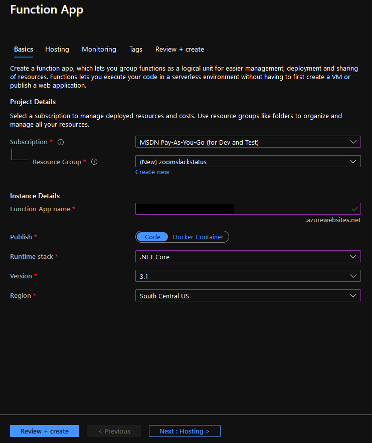

- Take note of the Function App name that was used and the URL for the application. (i.e.: `https://yourapp.azurewebsites.net`) This will be needed in subsequent installation steps.

- After setting up the Zoom and Slack apps, we will publish and configure the Azure function app.

### Zoom App
- Go to https://marketplace.zoom.us/develop/create and login to create a new Zoom application. Select the OAuth Create button.

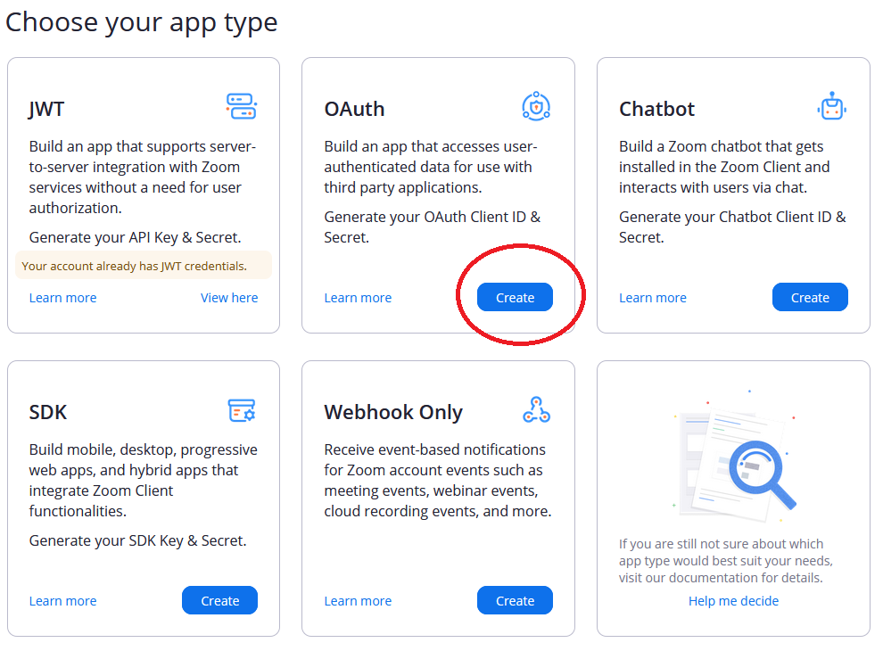

- Specify the name of the app and set the app type to `User-managed app` and click the Create button.

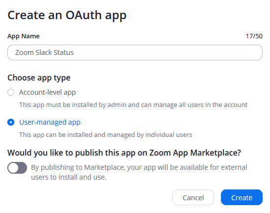

- Set the Redirect URL for OAuth and Whitelist URL to `https://yourapp.azurewebsites.net/api/ZoomAuthorizationSuccess`

- Be sure to take note of the Client ID and Client Secret of your Zoom app.

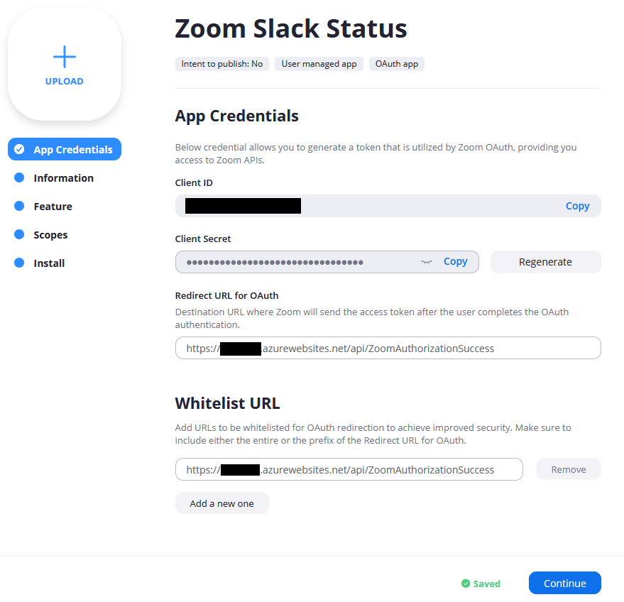

- After saving the previous settings, click Feature on the left and turn on the toggle for Event Subscriptions. Specify `https://youapp.azurewebsites.net/api/ZoomWebhook` for the Event notification endpoint URL.

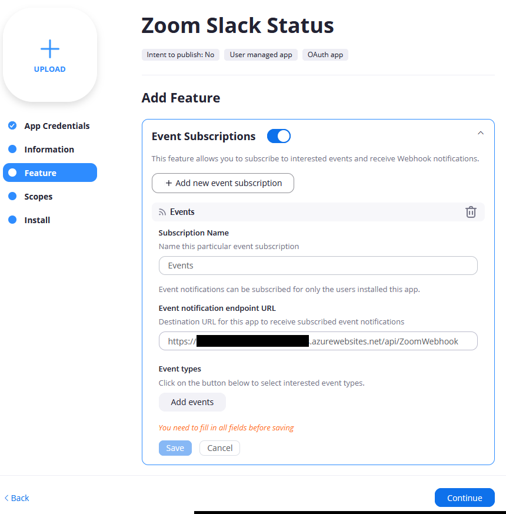

- Click the Add events button, and add the `User Activity` - `User's presence status has been updated` event.

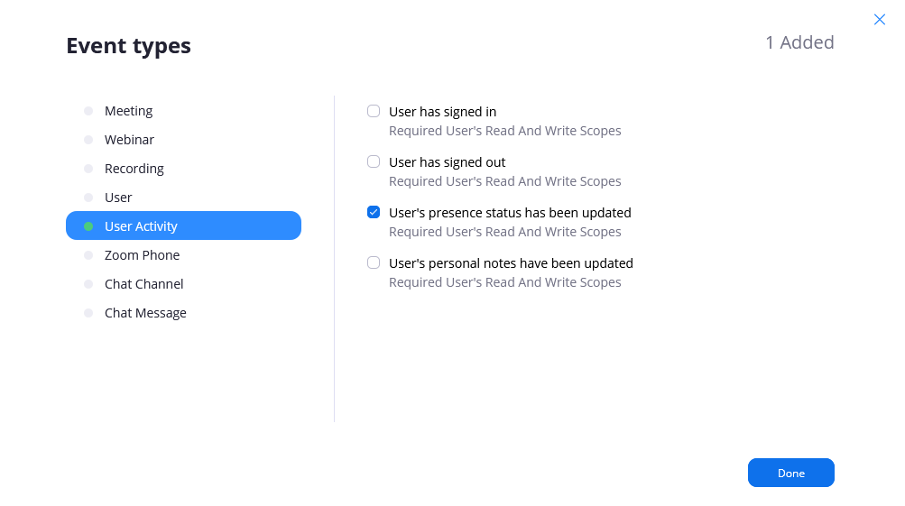

### Create Slack App
- Navigate to https://api.slack.com/apps to create a new app.

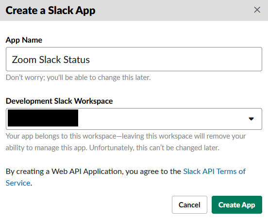

- After creating the Slack app, scroll down the Basic information page and take note of the Client ID and Client Secret. This will be needed in subsequent setup installation steps.

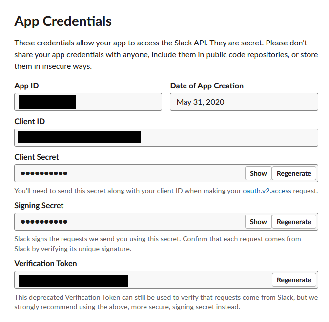

- Click OAuth & Permissions, click Add New Redirect URL and add `https://yourapp.azurewebsites.net/api/SlackAuthorizationSuccess`.

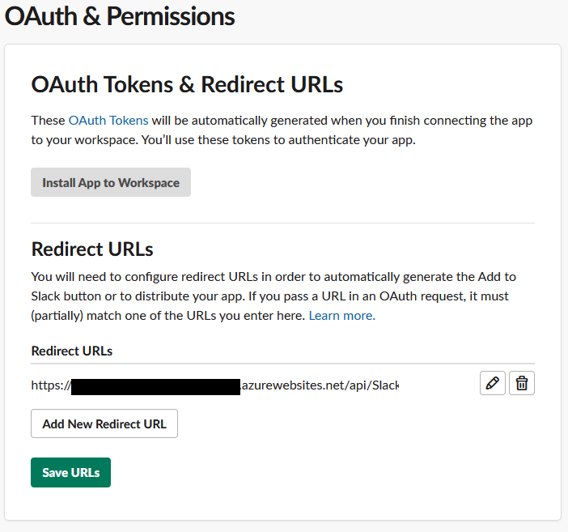

- Scroll down to Scopes and add the following User Token Scopes:
  - `users.profile:read`
  - `users.profile:write`

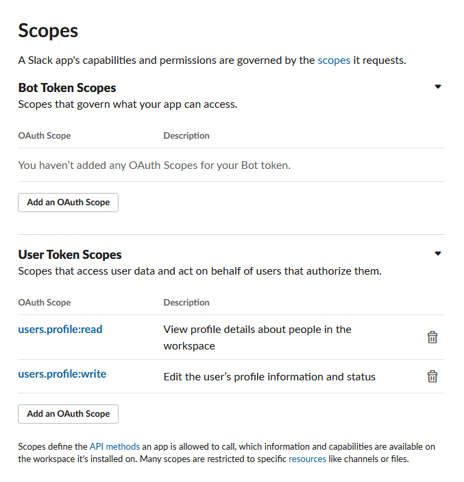

### Configure Azure Function App
- Go back to the Azure portal and navigate to the Azure Function app. Click on Configuration, then add the following Application settings.

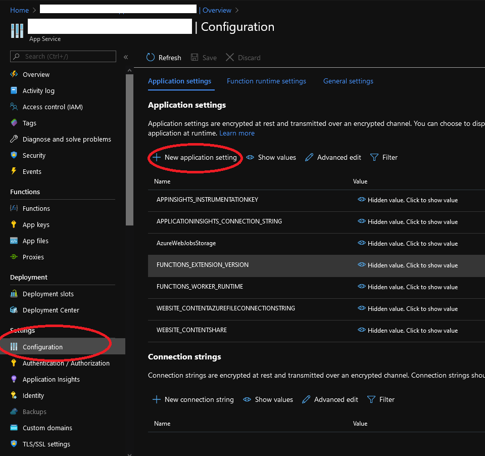

| Name | Value | Example
| -- | -- | -- |
| `BaseUri` | The url of your Azure Function app | `https://yourapp.azurewebsites.net` |
| `ZoomClientId` | Client ID of Zoom app | 
| `ZoomClientSecret` | Client Secret of Zoom app | 
| `ZoomVerificationToken` | Get this value from Feature tab in Zoom app settings | 
| `SlackClientId` | Client ID of Slack app |
| `SlackClientSecret` | Client Secret of Slack app | 
| `CloudStorageAccountConnectionString` | Connection string of Azure Storage account | `DefaultEndpointsProtocol=...`
| `InAMeetingStatusEmoji` | The emoji used for status when in a meeting |`:speech_balloon:`
| `InAMeetingStatusText` | The text used for status when in a meeting |`In a Zoom Meeting`

- Build and publish this project to your Azure Function app.

## Running
- After completing installation, users of your application can navigate to https://yourapp.azurewebsites.net/api/Install to authorize the application on their behalf.